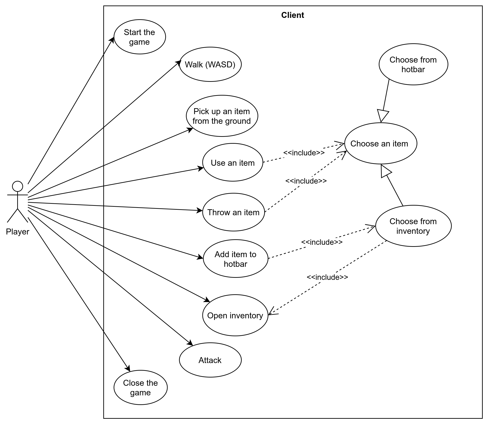
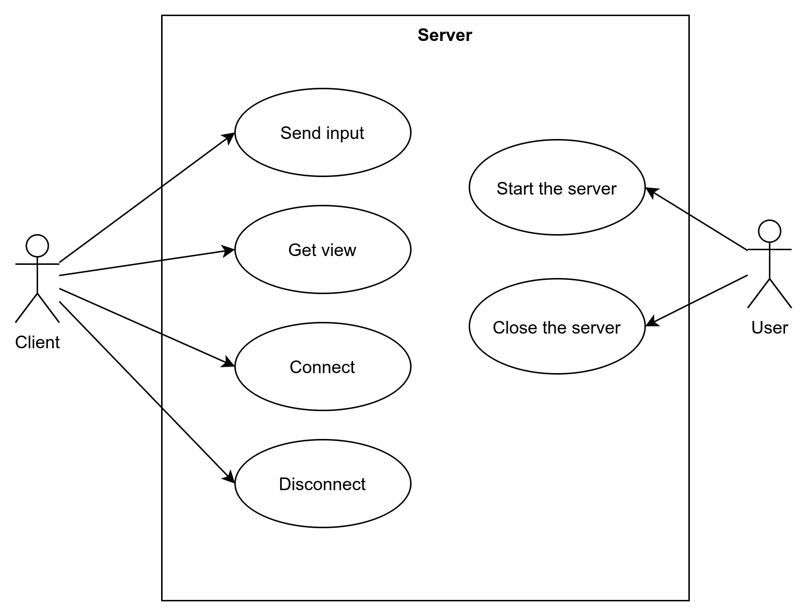
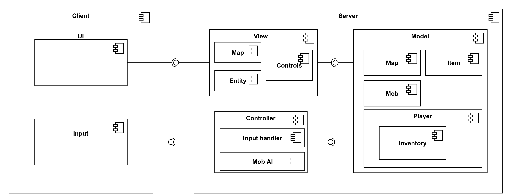

# Design Document
## Общие сведения
Многопользователькая игра в жанре Roguelike. Уровни генерируются случайным образом. Игроки могут исследовать окружающий мир, собирать предметы, сражаться с монстрами. Задача - добраться и пройти последний уровень игры (в многопользовательском режиме - пройти быстрее всех). 
## Architectural drivers
### Требования
- Уровни генерируются случайным образом (каждая попытка пройти игру предоставляет уникальную карту мира);
- Возможность собирать предметы и использовать их;
- Возможность ататковать монстров;
- Если игрок умирает, то начинает игру с первого уровня; 
- Единый набор возможных действий для каждого игрока.

### Use Case диаграммы

### Ограничения
- Клиент-серверная архитектура
- Возможность запустить приложение на Linux, Windows и MacOS

## Диаграмма компонентов

### Распределение компонентов между участниками команды (тут я не знаю, что писать)
### Диаграмма классов для компоненты Model:

