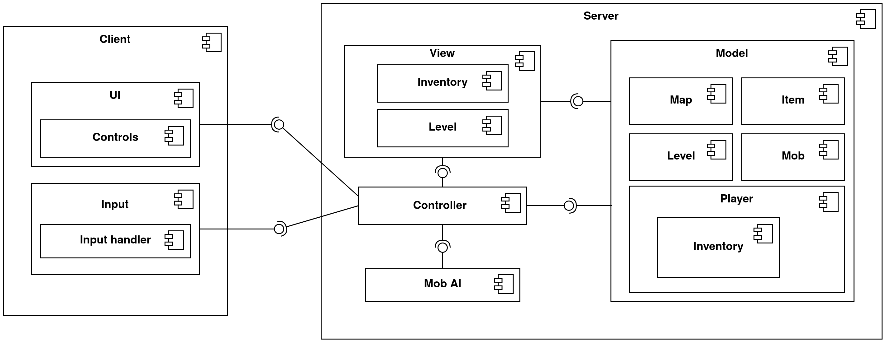

# Design Document
## Общие сведения
Многопользовательская игра в жанре Roguelike. Уровни генерируются случайным образом. Игроки могут исследовать окружающий мир, собирать предметы, сражаться с монстрами. Задача — добраться и пройти последний уровень игры (в многопользовательском режиме — пройти быстрее всех). 
## Architectural drivers
### Требования
- Уровни генерируются случайным образом (каждая попытка пройти игру предоставляет уникальную карту мира);
- Возможность собирать предметы и использовать их;
- Возможность атаковать монстров;
- Если игрок умирает, то начинает игру с первого уровня; 
- Единый набор возможных действий для каждого игрока.

### Случаи использования (Use Case диаграммы)

### Ограничения
- Клиент-серверная архитектура
- Возможность запустить приложение на Linux, Windows и MacOS

## Диаграмма компонентов

### Распределение компонентов между участниками команды
* **Екатерина**
    - UI
    - Input
    - Controller
* **Егор**
    - View
    - Model

### Диаграмма классов для компоненты Model

### Диаграмма классов для Controller и связанных классов

